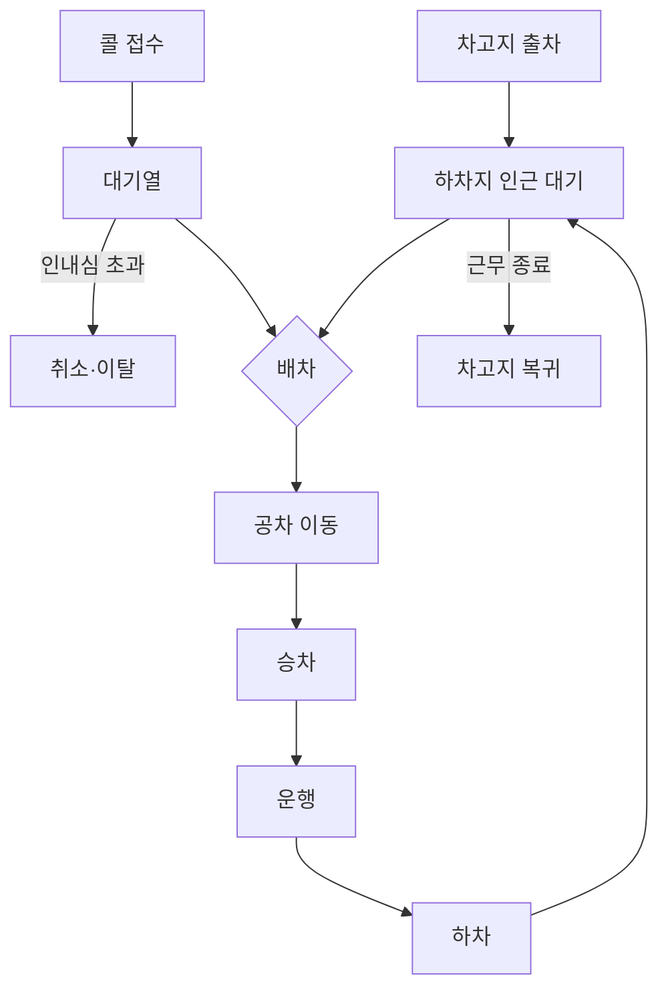

# Methodology

이 문서는 **장애인콜택시 대기거점 후보를 어떤 방식으로 시뮬레이션했는지** 설명합니다. 데이터 정제와 품질 검증은 [Data Validation](data_validation.md), 개별 가정의 근거는 [Assumptions](assumptions.md), 평가 결과는 [Results](results.md)에서 다룹니다.

## 1. Simulation Overview

모델은 SimPy 기반 **Discrete Event Simulation(DES)** 입니다. 핵심 개체는 `Call`과 `Vehicle` 두 종류이며, 배차 이벤트에서 서로 연결됩니다.

차량은 근무 시간 동안 `대기 → 배차 → 공차 이동 → 승차 → 운행 → 하차 → 대기`를 반복합니다. 콜은 접수 후 배차를 기다리며, 설정된 인내심을 넘으면 대기열에서 이탈합니다.

## 2. Analysis Population & Period

시뮬레이션 모집단은 **특장차**로 한정합니다. 특장차와 임차택시는 첫 운행 시각, 근무 길이, 취소율 등 운영 패턴이 달라 하나의 공급 체계로 재생하기 어렵기 때문입니다.

전체 분석은 2025년 연간을 기준으로 하지만, 후보 반복실험은 계산 효율과 대표성을 고려해 **2025-08-20 ~ 2025-09-18의 30일**을 사용합니다. 이 구간은 30일 이동창 중 연간 평균 대기시간과 가장 가까운 기간으로 선정됐습니다.

| 항목 | 값 |
|---|---:|
| 대표 기간 콜 | 108,223건 |
| 대표 기간 승차 | 91,344건 |
| 대표 기간 평균 대기 | 40.75분 |
| 연간 평균 대기 | 40.8분 |

## 3. Call Process

각 콜은 접수시각과 출발 행정동을 기준으로 시뮬레이션에 들어옵니다.

- 즉시콜만 재생합니다.
- 서울 25개 자치구에서 출발한 콜을 대상으로 합니다.
- 예약콜은 직접 재생하지 않고, 실제 예약 운행량을 공급 차감에 반영합니다.
- 즉시 취소는 접수 시점의 외생 확률로 분리합니다.
- 대기 중 포기는 실측 인내심 분포를 기반으로 처리합니다.
- 배차 후 취소는 별도 확률로 반영합니다.

## 4. Vehicle Supply & Shift Modeling

연간 등장한 고유 차량번호는 723대지만 이는 **연간 누적 차량 수**입니다. 실제 공급 규모는 일별 가동 차량을 기준으로 재구성했습니다.

| 구분 | 가동 차량 |
|---|---:|
| 평일 중앙 | 574대 |
| 주말 중앙 | 374대 |

차량-일 169,446건의 첫 승차와 마지막 하차에서 근무 패턴을 재구성했습니다.

| 출차 시각 | 차량-일 비중 |
|---|---:|
| 07시 | 28.4% |
| 08시 | 24.3% |
| 12시 | 23.8% |
| 13시 | 6.0% |
| 15시 | 3.3% |

위 다섯 시각이 차량-일의 85.8%를 설명하며, 근무 길이 중앙값은 **6.72시간**입니다.

현재 44개 거점의 배속 정원 비율을 이용해 그날의 가동 차량을 거점별로 배분합니다. 배속 정원 합은 691이며, 공영주차장의 물리적 면수와 구분해 사용합니다.

## 5. Dispatch Logic

배차는 콜 도착 또는 차량 유휴 전환 시점마다 국소적으로 수행합니다.

1. 탐색 반경 안의 가용 차량 또는 대기 콜을 찾습니다.
2. 접수순서, 경과대기, 이동시간을 이용해 후보를 비교합니다.
3. 반경 안 후보 중 조건을 만족하는 매칭을 실행합니다.
4. 배차된 차량은 승차지까지 공차 이동합니다.

탐색 반경은 운영 안내에서 확인된 주간·야간 기준을 사용하며, 평일 심야 구간처럼 원문에서 직접 확인되지 않은 부분은 [Assumptions](assumptions.md)에 별도 표시합니다.

실제 배차 과정의 기사 수락, 거절, 차량 상태, 사전 점유 등은 데이터로 직접 관측할 수 없어 모델에 모두 재현하지 못합니다. 이 한계가 절대 픽업시간 재현에 가장 큰 영향을 줍니다.

## 6. Travel Time Estimation

이동시간은 승차→하차 실측 기록에서 구성합니다. 외부 길찾기 API보다 실측 OD를 우선해 교통·시간대 효과를 데이터 안에서 반영했습니다.

| 순서 | 방식 | 커버율 |
|---|---|---:|
| 1 | 출발동 × 목적동 × 시간대 × 평일/주말 실측 중앙값 | 76.5% |
| 2 | 거리대 × 시간대 × 요일별 속도 기반 추정 | 23.1% |
| 3 | 시간대·요일 평균속도 기반 폴백 | 소수 |
| 동 내부 | 동일 동 실측 이동시간 | 0.4% |

전체 조회의 절대중앙오차는 약 **2.5분**입니다. 거리 기반 추정에는 중심점 직선거리와 실측에서 검산한 우회계수 1.33을 사용합니다.

## 7. Cancellation & Patience

대기 중 포기는 취소자만 이용해 분포를 만들지 않고 **Kaplan–Meier 생존분석**으로 추정합니다. 승차까지 기다린 콜을 우측절단으로 포함해 생존편향을 줄였습니다.

| 항목 | 값 |
|---|---:|
| 즉시 취소 | 3.16% |
| 대기 중 포기 | 104,422건 |
| KM 분석 절단 | 1,079,330건 |
| KM 중앙 인내심 | 186분 |
| 취소자만 사용한 단순 중앙 | 16.8분 |

인내심은 콜별 난수로 표집하고, 실제 배차 시각이 인내심보다 늦으면 이탈하도록 구현합니다.

## 8. Candidate & Intervention Design

후보 풀 639곳 중 차량 진입 유효고를 확인할 수 없는 옥내·혼합 시설은 제외하고 **옥외 348곳**을 후보 풀로 사용했습니다. 행정동별 후보 배정 결과 실제 시뮬레이션에 사용되는 서로 다른 후보는 **244곳**입니다.

신규 거점 개입은 모든 후보에 동일한 **배속 정원 10대 추가**로 정의합니다. 기존 44개 거점의 배속은 변경하지 않습니다.

정원비 `701 / 691`을 실제 일별 가동 대수에 적용하므로 대표적으로 다음과 같이 증가합니다.

| 구분 | Before | After | 신규 거점 배분 |
|---|---:|---:|---:|
| 평일 | 574 | 582 | 8대 |
| 주말 | 374 | 379 | 5대 |

즉 10대는 배속 정원이며, 특정 날짜에 실제로 운행하는 차량 수는 요일별 가동률을 반영합니다.

## 9. Randomness & Reproducibility

후보 비교에서 난수 차이가 효과 차이처럼 보이지 않도록 **Common Random Numbers** 구조를 사용합니다.

- 콜 단위 확률값은 `(call_id, seed, stream)`으로 고정합니다.
- 인내심, 즉시 취소, 취소 시각, 배차 후 취소를 별도 스트림으로 분리합니다.
- 차량 근무 편성은 순번이 아니라 고정 Slot ID에 연결합니다.
- 후보 평가는 Seed 42·43·44로 반복합니다.

차량 Slot을 고정한 뒤 후보 비교 과정의 동별 픽업시간 난수 변동은 약 **0.465분에서 0.039분**으로 감소했습니다.

## 10. Model Boundaries

모델이 직접 다루지 않는 범위는 다음과 같습니다.

| 항목 | 처리 |
|---|---|
| 예약콜 | 직접 재생하지 않고 공급 차감으로 반영 |
| 서울 밖 출발 | 입력에서 제외 |
| 서울 밖 목적지 | 운행은 포함, 좌표 부족 시 이동시간 폴백 |
| 차량 고장·결행 | 미모델링 |
| 기사 휴게·충전 | 별도 상태로 직접 모델링하지 않음 |
| 기사 수락·거절 과정 | 데이터 부족으로 직접 재현하지 않음 |
| 억제된 수요 | 접수된 콜만 관측 가능 |
| 유휴 차량의 실제 위치 | 하차지 인근 대기로 가정 |

모델 선택 과정에서 실측 대기 수준을 더 잘 맞추지만 다른 검증 지표를 악화시키는 설정도 확인했습니다. 해당 설정을 채택하지 않은 이유는 [Results — Model Selection Decisions](results.md#5-model-selection-decisions)에 정리했습니다.
